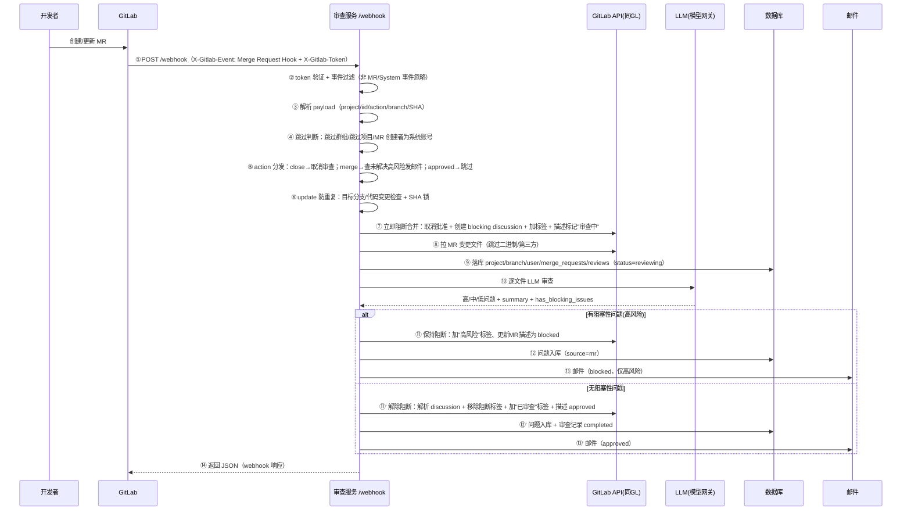

做代码审查平台时，最常被问的一句话是：**MR 是怎么被自动审查的？** 答案是 GitLab Webhook——GitLab 上发生事件时主动向配置的 URL 发 HTTP POST，审查服务收到后走「先阻断 → 审查 → 再放行」的闭环。本文把这条链路从机制到实现完整拆开。

文中所有主机地址、端口、真实部署路径均以占位符表示，不含内部部署信息；结论均来自源码（附函数/行号）与实机验证。

---

## 一、GitLab Webhook 机制基础

### 1.1 什么是 Webhook

Webhook 是 GitLab 的**出站事件通知**：GitLab 上发生指定事件（push、MR 创建/更新/合并等）时，GitLab 主动向配置好的 URL 发送一个 **HTTP POST 请求**（JSON body）。调用方无需轮询，事件一到即触发。

### 1.2 常见事件类型（X-Gitlab-Event 头）

| 事件 | X-Gitlab-Event 头 | 触发时机 |
|------|-------------------|----------|
| **Merge Request Hook** | `Merge Request Hook` | MR 创建/更新/批准/关闭/合并等 |
| Push Hook | `Push Hook` | 代码 push（本平台不走此事件，走 pre-receive hook） |
| System Hook | `System Hook` | 系统级事件（用户/项目/群组变更） |
| Note/Issue/Pipeline 等 | 各自名称 | 评论/问题/流水线 |

审查服务的 `/webhook` 端点**只处理 `Merge Request Hook` 和 `System Hook`**，其余事件直接忽略。

### 1.3 配置位置与要点（GitLab 侧）

```
项目 → Settings → Webhooks（或群组/实例级）
  URL:          http://<审查服务主机>:<端口>/webhook
  Secret token: 与服务端配置的 WEBHOOK_TOKEN 一致
  触发事件:     勾选 "Merge request events"
```

要点：
- **Secret token 验证**：GitLab 发送时带 `X-Gitlab-Token` 头，服务端比对 `WEBHOOK_TOKEN`（未配置时放行）
- **超时**：GitLab 默认 webhook 超时 **10 秒**（可配 10-60s），超时后 GitLab 会**自动重试**——这是同步处理架构的最大风险点（见 §四）
- **SSL**：http 目标无需证书；https 目标需有效证书或关闭验证

### 1.4 MR 事件的 Payload 结构（关键字段）

```jsonc
{
  "object_kind": "merge_request",
  "user": { "id": 123, "name": "zhang", "username": "zhang", "email": "..." },  // 操作人
  "project": { "id": 90, "name": "demo", "namespace": "G20" },
  "object_attributes": {
    "iid": 5,                    // MR 序号（页面上的 !5）
    "title": "feat: xxx",
    "action": "open|update|merge|close|approved|unapproved",
    "state": "opened|merged|closed",
    "source_branch": "feature/a",
    "target_branch": "main",
    "url": "http://<gitlab主机>/.../merge_requests/5",
    "last_commit": { "id": "9d8f2c..." },   // MR 最新 commit SHA
    "created_at": "...", "updated_at": "..."
  }
}
```

---

## 二、MR 审查完整流程

### 2.1 时序总览



### 2.2 逐步拆解

| 步 | 动作 | 实现要点 |
|----|------|----------|
| ③ 解析 | 从 payload 取 project_id/name/namespace、mr_iid、title、`last_commit.id`（MR SHA）、action、source/target_branch | SHA 取 `object_attributes.last_commit.id` |
| ④ 跳过判断 | ①群组在跳过名单 ②项目在跳过名单 ③`user.name == 'root'`（系统账号 MR 跳过） | 命中任一返回 skipped |
| ⑤ action 分发 | `close`→取消进行中审查+删 SHA 记录；`approved/unapproved`→跳过；`merge`→查未解决高风险，有则发 merged 提醒邮件 | merge 不重新审查 |
| ⑥ 防重复（update） | 目标分支是否变更（对比库中记录）→ 变更则取消重审；代码是否变更（按 SHA 判断）→ 无变更跳过 | **SHA 锁**：审查前立即写入，相同 SHA 不重复审查 |
| ⑦ 立即阻断 | ①取消 MR 批准（合并按钮变红）②创建 `resolvable=True` 的 discussion「🔴 代码审查中」③加标签（阻断+审查中）④MR 描述插入审查中标记 | 阻断是**双保险**：批准态 + blocking discussion |
| ⑧ 拉变更 | 经 GitLab API 拉 MR changes，跳过二进制/第三方（vendor）文件 | 过滤文件类型减少无效审查 |
| ⑨ 落库 | 建 project/branch/user/mr 记录 + 创建 review（source=mr，status=reviewing） | user email webhook 可能不带，用 API 补 |
| ⑩ LLM 审查 | 按变更文件逐个调用 LLM（经模型网关），内部有重试/额度切换 | 返回 high/medium/low、issues、has_blocking_issues、failed_files |
| ⑪ 结果处理 | `has_blocking_issues=True` → 保持阻断（加高风险标签、描述更新 blocked、发邮件）；否则解除阻断 | 全文件失败→failed；部分失败→partial（无高风险则 warning） |
| ⑪′ 解除阻断 | 移除阻断标签+加已审查标签、**解析 blocking discussion**（仅解析本服务创建的）、描述更新 approved | 解阻后 MR 可正常合并 |
| ⑫ 入库 | 问题写入 issues 表（source=mr，带 fingerprint/severity/category）；审查记录更新 stats/status | 高风险问题同步写 |
| ⑬ 邮件 | 仅高风险发（blocked/merged）；approved 也发但内容为通过 | 收件人取 MR 参与者（作者+评审人+抄送组） |

### 2.3 关键 GitLab API 调用对照

| 函数 | 对应 GitLab REST API | 用途 |
|------|---------------------|------|
| get_mr_changes / get_mr_diff | `GET /projects/:id/merge_requests/:iid/changes` | 拉 MR 变更 |
| create_discussion | `POST /projects/:id/merge_requests/:iid/discussions` | 创建阻断讨论 |
| resolve_discussion | `PUT /projects/:id/merge_requests/:iid/discussions/:did`（resolve=true） | 解除阻断 |
| get_discussions | `GET .../discussions` | 列出讨论（解阻回退） |
| get_mr / update_mr | `GET/PUT /projects/:id/merge_requests/:iid` | 读 MR 状态/更新描述、批准状态 |
| approve_mr / unapprove_mr | `POST .../approve` / `DELETE .../approve` | 批准/取消批准（阻断手段） |
| add_labels / remove_labels | `PUT .../merge_requests/:iid`（labels） | 标签管理（审查中/高风险/已审查） |

---

## 三、阻断/解阻机制详解（核心设计）

```
阻断（审查开始）                    解除（审查通过）
┌─────────────────────┐            ┌──────────────────────┐
│ 1. 取消 MR 批准       │            │ 1. 解析 blocking      │
│    → 合并按钮变红不可点│            │    discussion         │
│ 2. 创建 blocking     │            │    → 恢复可合并        │
│    discussion        │            │ 2. 移除"审查中"标签     │
│    (resolvable=True) │            │ 3. 加"已审查"标签       │
│ 3. 加标签: 审查中     │            │ 4. 描述更新 approved    │
│ 4. 描述插入审查中标记  │            │                      │
└─────────────────────┘            └──────────────────────┘
```

- **批准态阻断**：GitLab 批准是 MR 合并的前置（若项目开了 "Approvals" 规则），取消批准 = 合并按钮变红
- **discussion 阻断**：创建 `resolvable=True` 的讨论，未 Resolve 前 GitLab 禁止合并（"All threads must be resolved" 规则）；解阻时只解析本服务创建的那一条，避免误动人工讨论
- **标签体系**：`审查中`/`高风险`/`已审查` 三类状态标签，便于 MR 列表一眼识别
- **MR 描述回写**：审查结果以注释标记块写入 MR 描述，GitLab 页面直接可见

---

## 四、已知风险与注意点

1. **同步阻塞**：`/webhook` 处理是**同步的**——LLM 审查（实测 20s+）完成才返回；GitLab webhook 默认超时 10s 会**自动重试**，可能造成重复审查（有 SHA 锁防重，但重试期间会重复阻断/解阻动作）。改进方向：仿 push 改为异步返回 accepted + 后台线程
2. **SHA 锁是防重关键**：审查前立即写入 SHA，相同 SHA 的重复事件直接跳过；MR 关闭/合并时删除
3. **事件过滤**：只处理 `Merge Request Hook`/`System Hook`，push 事件走 pre-receive hook 链路（不在 /webhook）
4. **阻断依赖 GitLab 侧规则**：blocking discussion 生效需项目开启 "All threads must be resolved"；批准态阻断需项目开启 Approvals——若项目未开这些规则，阻断可能只剩标签提示（弱阻断）
5. **系统账号 MR 跳过**：机器人创建的 MR 不审查

---

## 五、排查清单（MR 审查不触发时）

- [ ] GitLab 项目/群组 Webhooks 里 URL 指向正确的服务（内网/外网各指各的审查服务）
- [ ] Secret token 与服务端配置一致（不一致返回 401）
- [ ] 勾选了 "Merge request events"
- [ ] 服务可达：从 GitLab 所在网络能访问 webhook URL（跨网段需防火墙放行）
- [ ] 服务日志出现 `[MR] 收到 MR 审查请求` 则已触发；无日志则 webhook 未送达
- [ ] GitLab webhook 投递记录：项目 → Settings → Webhooks → 最近投递（看状态码/响应体）
- [ ] 项目不在跳过名单中，创建者不是系统账号
